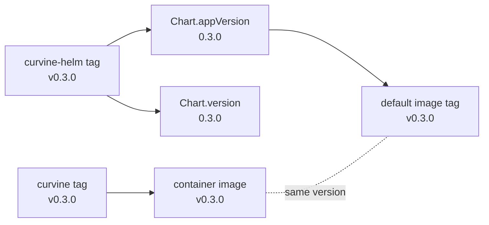

# Curvine Helm Charts

Source repository for the Curvine Helm charts.

## Published Helm Repository

Public index:

```bash
helm repo add curvineio https://curvineio.github.io/curvine-doc/helm-charts
helm repo update
```

Published charts:

| Source Directory | Published Chart Name | Purpose |
| --- | --- | --- |
| `curvine-runtime/` | `curvine` | Curvine runtime cluster |
| `curvine-csi/` | `curvine-csi` | Curvine CSI driver |

## Quick Start

Install a minimal runtime cluster:

```bash
helm upgrade --install curvine curvineio/curvine \
  -n curvine \
  --create-namespace
```

Install the CSI driver:

```bash
helm upgrade --install curvine-csi curvineio/curvine-csi \
  -n curvine-system \
  --create-namespace
```

Install the CSI chart only after the Curvine runtime cluster is reachable and you are ready to create a `StorageClass`.

Before you install the runtime chart, make sure one of these is true:

- Your cluster has a default `StorageClass`
- You pass explicit `storageClass` values
- You use a `hostPath`-based example on bare metal

## Documentation

- Runtime chart: [curvine-runtime/README.md](./curvine-runtime/README.md)
- CSI chart: [curvine-csi/README.md](./curvine-csi/README.md)
- Release workflow: [.github/workflows/README.md](./.github/workflows/README.md)

## Repository Layout

```text
curvine-helm/
├── .github/workflows/        # Chart packaging and release workflow
├── curvine-runtime/          # Source for the published `curvine` chart
├── curvine-csi/              # Source for the published `curvine-csi` chart
└── README.md                 # Repository entrypoint
```

## Release Architecture

- This repository stores chart source code only.
- Chart packages are published to GitHub Releases.
- The public Helm index is served from `curvine-doc`.
- End users should install from `https://curvineio.github.io/curvine-doc/helm-charts`.

## Versioning Model

Curvine uses separate repositories for application code, container images, and Helm charts. The
version fields below keep those artifacts aligned without requiring manual image tag edits on
every release.

### Version Fields

| Field | Example | Where It Lives | Meaning |
| --- | --- | --- | --- |
| Curvine git tag | `v0.3.0` | `CurvineIO/curvine` | Application release tag |
| Container image tag | `v0.3.0` | `ghcr.io/curvineio/curvine`, `ghcr.io/curvineio/curvine-csi` | Image built from the matching Curvine tag |
| Helm git tag | `v0.3.0` | `CurvineIO/curvine-helm` | Chart release tag in this repository |
| `Chart.version` | `0.3.0` | `Chart.yaml` | Helm chart package version |
| `Chart.appVersion` | `0.3.0` | `Chart.yaml` | Application version deployed by the chart |
| `values.image.tag` | `""` | `values.yaml` | Optional image tag override |

### How They Relate



Rules:

1. **Curvine release drives images.** Pushing `v0.3.0` in `CurvineIO/curvine` builds and publishes
   `ghcr.io/curvineio/curvine:v0.3.0` and `ghcr.io/curvineio/curvine-csi:v0.3.0`.
2. **Helm release drives chart metadata.** Pushing `v0.3.0` in this repository packages charts with
   `version: 0.3.0` and `appVersion: "0.3.0"`.
3. **Image tag defaults from `appVersion`.** `values.yaml` leaves `image.tag` empty. Templates
   resolve it to `latest` when `Chart.AppVersion` is `latest`, otherwise `v{Chart.AppVersion}`
   (for example `0.3.0` becomes `v0.3.0`).
4. **`Chart.version` and `Chart.appVersion` usually match** for versioned releases. For `main`
   branch test packages, `Chart.version` stays `<base>-dev` while `appVersion` is `latest`.
5. **Override when needed.** Use `--set image.tag=...` for custom images, hotfixes, or pinned builds.

### Release Mapping

| Trigger in `curvine-helm` | `Chart.version` | `Chart.appVersion` | Default `image.tag` |
| --- | --- | --- | --- |
| Push `v0.3.0` tag | `0.3.0` | `0.3.0` | `v0.3.0` |
| Push to `main` | `<base>-dev` | `latest` | `latest` |

`main` branch test packages use rolling `latest` images from the registry. The chart package
version remains `<base>-dev` so it does not collide with versioned releases.

### Example: Versioned Release

```bash
# 1. Curvine publishes application binaries and images
#    CurvineIO/curvine tag: v0.3.0
#    images: ghcr.io/curvineio/curvine:v0.3.0
#            ghcr.io/curvineio/curvine-csi:v0.3.0

# 2. This repository publishes matching Helm charts
git tag v0.3.0
git push origin v0.3.0
# chart package version: 0.3.0
# chart appVersion: 0.3.0
# rendered image: ghcr.io/curvineio/curvine:v0.3.0

# 3. Install from the public Helm repository
helm repo add curvineio https://curvineio.github.io/curvine-doc/helm-charts
helm repo update
helm upgrade --install curvine curvineio/curvine --version 0.3.0 -n curvine --create-namespace
```

### Example: Override Image Tag

```bash
helm upgrade --install curvine curvineio/curvine \
  --set image.tag=v0.3.0-rc.1 \
  -n curvine --create-namespace
```

For workflow details and the release checklist, see
[.github/workflows/README.md](./.github/workflows/README.md).

## Local Development

Lint and package from source directories:

```bash
helm lint ./curvine-runtime
helm lint ./curvine-csi

mkdir -p dist
helm package ./curvine-runtime --destination dist
helm package ./curvine-csi --destination dist
```

Install locally from source:

```bash
helm upgrade --install curvine ./curvine-runtime -n curvine --create-namespace
helm upgrade --install curvine-csi ./curvine-csi -n curvine-system --create-namespace
```

## Links

- Curvine project: https://github.com/CurvineIO/curvine
- Helm documentation: https://helm.sh/docs/
